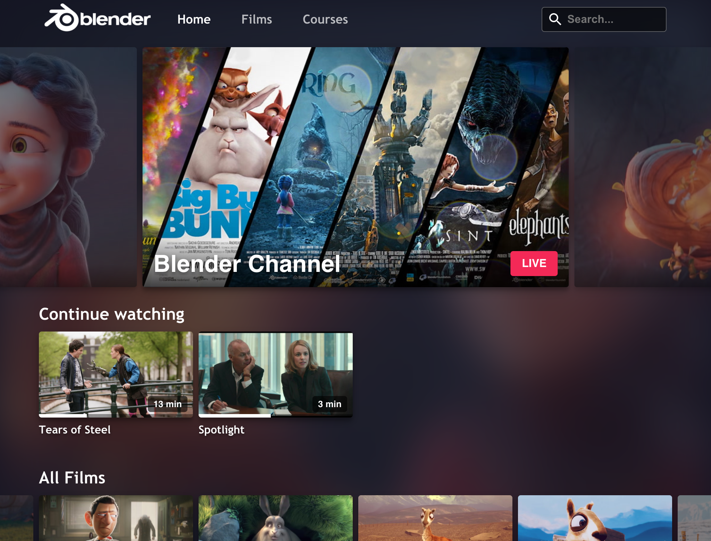
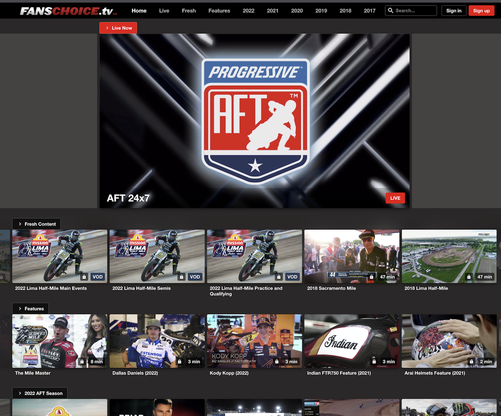

The JW OTT Webapp is an open-source, dynamically generated video website built around JW Player and JW Platform services. It enables you to easily publish your JW Player-hosted video content with no coding and minimal configuration.

**Examples of JW OTT Webapp in action:**
- [Free Content + Live + EPG](https://app-preview.jwplayer.com/?app-config=225tvq1i)
- [Ad-based Monetization](https://app-preview.jwplayer.com/?app-config=egpovogv)
- [Subscription-based Monetization](https://app-preview.jwplayer.com/?app-config=kziwdpjr)
- [Authentication-based Access](https://app-preview.jwplayer.com/?app-config=ajs7jdfk)
- [Right Rail Page Layout (Inline Player)](https://app-preview.jwplayer.com/?app-config=1rbui8uf)

**Examples built using the JW OTT Webapp**

<table>
  <tr>
    <td>
      
Symphony   (<a href="https://symphony.live/">symphony.live</a>)

      
    </td>
    <td>
      
FansChoice.tv    (<a href="https://www.fanschoice.tv/">fanschoice.tv</a>)

      
    </td>
    <td>
      
Trinity Broadcasting Network    (<a href="https://watch.tbn.org/">watch.tbn.org</a>)

      
    </td>
  </tr>
</table>

## Documentation

- [Configure JW OTT Webapp](./docs/configuration.md)
- [Contributing Guidelines](CONTRIBUTING.md)
- [Frameworks, SDK's and Libraries](./docs/frameworks.md)
- [Backend Services](./docs/backend-services.md)
- [Developer Guidelines](./docs/developer-guidelines.md)

## Supported Features

- Works with any JW Player edition, from Free to Enterprise (note that usage will count against your monthly JW streaming limits). Only cloud-hosted JW Players are supported.
- It looks great on any device. The responsive UI automatically optimizes itself for desktop, tablet, and mobile screens.
- Populates your site's media content using JSON feeds. If you are using JW Platform, this happens auto-magically based on playlists that you specify. Using feeds from other sources will require you to hack the source code.
- Video titles, descriptions and hero images are populated from JW Platform JSON feed metadata.
- Playback of HLS video content from the JW Platform CDN. You can add external URLs (for example, URLS from your own server or CDN) to your playlists in the Content section of your JW Player account dashboard, but they must be HLS streams (`.m3u8` files).
- Support for live video streams (must be registered as external .m3u8 URLs in your JW Dashboard).
- Customize the user interface with your own branding. The default app is configured for JW Player branding and content, but you can easily change this to use your own assets by modifying the `config.json` file. Advanced customization is possible (for example, editing the CSS files), but you will need to modify the source code and [build from source](docs/build-from-source.md).
- Site-wide video search and related video recommendations powered by [JW Recommendations](https://support.jwplayer.com/customer/portal/articles/2191721-jw-recommendations).
- Basic playback analytics is reported to your JW Dashboard.
- Ad integrations (VAST, VPAID, GoogleIMA, etc.). These features require a JW Player Ads Edition license. For more information, see the [JW Player pricing page](https://www.jwplayer.com/pricing/).
- A "Favorites" feature for users to save videos for watching later. A separate list for "Continue Watching" is also kept so users can resume watching videos from where they left off. The lists are per-browser at this time (i.e., lists do not sync across user's browsers or devices). The "Continue Watching" list can be disabled in your JW OTT Webapp's `config.json` file.
- A grid view for a particular playlist of videos, with the ability to deep-link to the playlist through a static URL.
- Social sharing options using the device native sharing dialog.
- 24x7 live channel(s) screen with Electronic Programming Guide (EPG) view.

## Unsupported Feature(s)

- Self-hosted JW Players

## Getting started

- Clone this repository
- Run `yarn` to install dependencies
- Run `yarn start`

## Support and Bug Reporting

To report bugs and feature requests, or request help using JW OTT Webapp, use this repository's [Issues](https://github.com/jwplayer/ott-web-app/issues) page.

## Software License

This project is licensed under under the [Apache License, Version 2.0](https://www.apache.org/licenses/LICENSE-2.0).  See [LICENSE.txt](LICENSE.txt) for more details.
