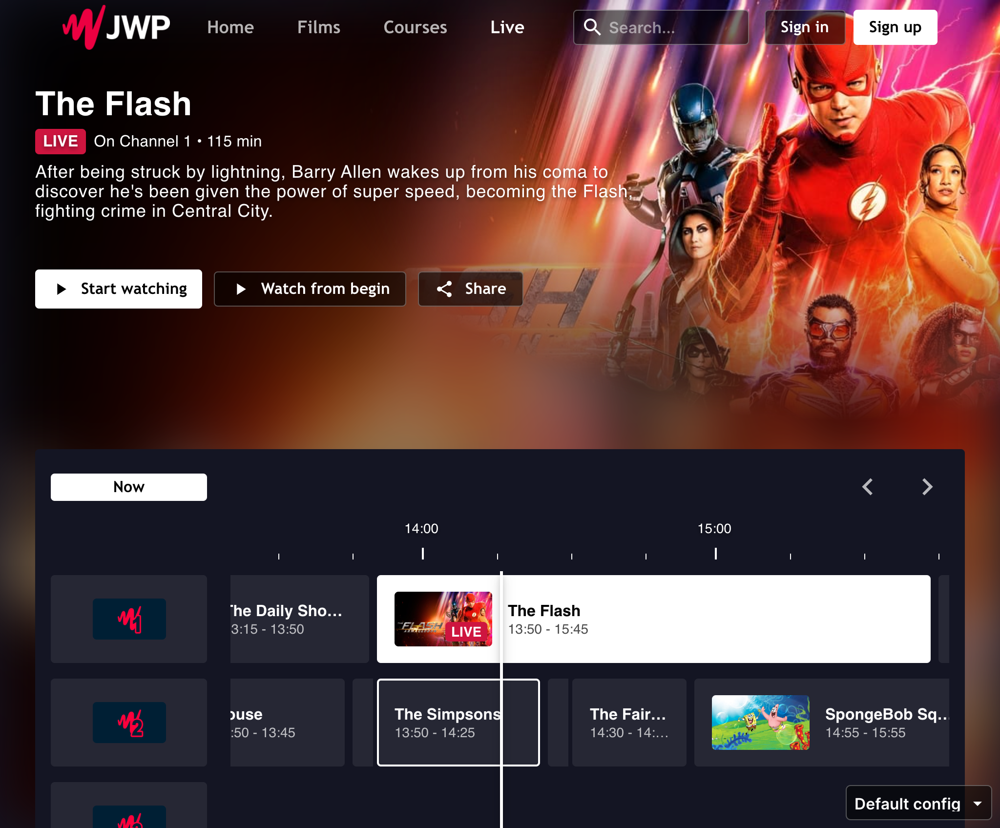

# 24x7 live channels with EPG

If you want to list one or more 24x7 livestream channels, it is possible to enable a custom page with an EPG view. Of
course, you would need to have EPG data available for this to work.



Below are the steps to enable the live channels page in your OTT Webapp.

## Create a Live Channels playlist

Navigate to the JW Dashboard and create a new MANUAL playlist. You can give any name to this playlist. This is useful if
you want to add this playlist as a shelf on the homepage.

Note down the playlist ID for future reference.

Add all live channel media items to the playlist. The order you put them in is respected, so order the media items
accordingly.

Go to the "Custom Parameters" section and add a new parameter with name "contentType" and value "Live".

## Update Live Channel Media Items

This step is needed for all live channel media items you've added to the playlist in the previous step.

Add the following Custom Parameters to the media item:

- **contentType**: LiveChannel
- **liveChannelsId**: playlist id noted down in previous step
- **scheduleUrl**: URL to your EPG data

## Add a Live menu item

If you've completed the previous steps, you should be able to add a menu item using the noted down playlist ID.

In your OTT config file, add a new item in the `menu` section:

```json
{
  "menu": [
    {
      "label": "Live",
      "contentId": "LIVE_PLAYLIST_ID",
      "type": "playlist"
    }
  ]
}
```

> Replace `LIVE_PLAYLIST_ID` with the Live Channels playlist ID created earlier.

Now when you open your OTT Webapp, you should see a new menu item in the header or drawer on mobile devices. After
clicking on the "Live" menu item, the Live Channels page with EPG view should be visible.

## EPG Data structure

The EPG view expects a certain data structure in order to work. This is based on the VIS Chapterpoints API so that it
integrates seamlessly.

```json
[
  {
    "id": "00990617-c229-4d1e-b341-7fe100b36b3c",
    "title": "Peaky Blinders",
    "startTime": "2022-07-15T00:05:00Z",
    "endTime": "2022-07-15T00:55:00Z",
    "chapterPointCustomProperties": [
      {
        "key": "description",
        "value": "A gangster family epic set in 1900s England, centering on a gang who sew razor blades in the peaks of their caps, and their fierce boss Tommy Shelby."
      },
      {
        "key": "image",
        "value": "https://www.themoviedb.org/t/p/w1066_and_h600_bestv2/wiE9doxiLwq3WCGamDIOb2PqBqc.jpg"
      }
    ]
  }
]
```
