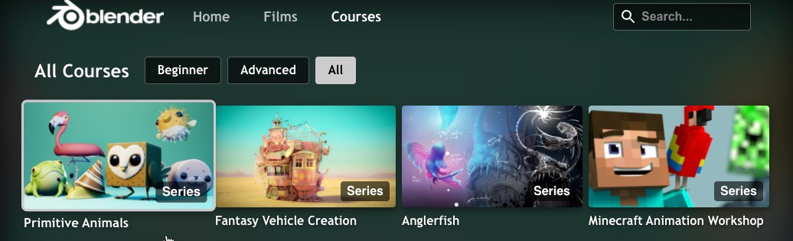

# Series

Series enables customers to bundle episodic content such as TV shows and learning courses or non-episodic content like sports leagues events.  By organizing content into a series, viewers are guided through the content. Series have a predefined sequence of episodes and can be split in seasons.


Series are tagged with `Series` in [shelves and libraries](shelves-and-libraries.md):



Series are defined through 'series playlist'. This is handled in the first piece of this article.

In the near future JW player will native series construct. This is handled in the second part of this article.

## Series through playlist

Series are not a native construct in the JW Dashboard at this moment. So customers create a 'series playlist' and set the sequences and episodes using custom parameters.

### Creating series playlists in the dashboard

The [JW manual](https://support.jwplayer.com/articles/build-an-ott-apps-series-playlist) describes the following process to create a serie playlist.

### Series in libraries and shelves

[Shelves and libraries](shelves-and-libraries.md) load their data using the [GET playlist endpoint](https://developer.jwplayer.com/jwplayer/reference/get_v2-playlists-playlist-id). Some items in this  playlis refer to series. These are identified using the `seriesId` , which links to the  playlist that contains the episodes. 

```
GET playlist/o45EkQBf
{
"title":"All Courses",
"description":"",
"kind":"DYNAMIC",
"feedid":"o45EkQBf",
"playlist":[
 {
   "mediaid":"txHnOU0x",
   "seriesId":"xdAqW8ya",
   "episodes":"4"
   "title":"Primitive Animals",
   "image":"https://content.jwplatform.com/v2/media/txHnOU0x/poster.jpg?width=720",
   "duration":0,
   "pubdate":1615379806,
   "description":"Aimed at beginners, this workshop helps you connect basic Blender functionality into a complete workflow and mindset for building characters.",
   "tags":"course,Beginner"
 },
 { }
]
}
```

### Series detail window

The series detail window loads the series playlist using the [GET playlist endpoint](https://developer.jwplayer.com/jwplayer/reference/get_v2-playlists-playlist-id). The episodelabel(e.g. `S1:E1`)  is coming from `seasonNumber` and `episodeNumber` 

```
GET playlist/xdAqW8ya
{
"title":"Primitive Animals",
"description":"Aimed at beginners, this workshop helps you connect basic Blender functionality into a complete workflow and mindset for building characters.",
"kind":"DYNAMIC",
"feedid":"xdAqW8ya",
"playlist":[
 {
   "title":"Blocking",
   "mediaid":"zKT3MFut",
   "image":"https://content.jwplatform.com/v2/media/zKT3MFut/poster.jpg?width=720",
   "feedid":"xdAqW8ya",
   "duration":345,
   "pubdate":1615370400,
   "description":"If you're brand new to Blender or are getting stuck, check out the Blender 2.8 Fundamentals series.",
   "tags":"seriesId_xdAqW8ya,lesson",
   "seasonNumber":"1",
   "episodeNumber":"1",
   "genre":"Beginner",
   "rating":"CC-BY"
 },
 {
   "title":"Modeling",
   "mediaid":"QLPqP2u8",
   "image":"https://content.jwplatform.com/v2/media/QLPqP2u8/poster.jpg?width=720",
   "feedid":"xdAqW8ya",
   "duration":184,
   "pubdate":1615374000,
   "description":"If you're brand new to Blender or are getting stuck, check out the Blender 2.8 Fundamentals series.",
   "tags":"seriesId_xdAqW8ya,lesson",
   "seasonNumber":"1",
   "episodeNumber":"2",
   "genre":"Beginner",
   "rating":"CC-BY"
 }
}
```

## Native series

JW Player has native series management from the JW Dashboard:

- simplifies the series creation workflow
- automatically calculate the number of episodes and duration of series
- contains trailers and bonus content

This section describes how this will work. 

### Creating native series in the dashboard

1. Customers define series 
2. Customers create media items each of which represents a series
3. Customers add a `seriesId` custom param to created media items
4. Customers publish their series by putting media items into a playlist

### Native series in shelves and libraries

[Shelves and libraries](shelves-and-libraries.md) load their data using the [GET playlist endpoint](https://developer.jwplayer.com/jwplayer/reference/get_v2-playlists-playlist-id). Some items in this playlis refer to series. These can be recognized with the `seriesId` custom param.

```
GET playlist\<playlistid>
[
 {
     "medaid":"dwEE1oBP",
     "title":"Video Title",
     "description":"Lorem ipsum",
     "seriesId": "aSZZ1oBP",
     "images":[],
     "sources":[],
     "tracks":[]
 }
]
```

We do not show episode number and season number for separate series episodes. If you click on such an item, you will see a simple movie page.

### Native series detail window

The series detail window loads the series playlist using a GET Series endpoint:

```
  GET /apps/series/{series_id}
  { 
  "title": "A Series of Unfortunate Events",
  "description": "The series follow’
  "series_id": "12345678",
  "total_duration": 12,
  "episode_count": 2,
  "episodes": [],
  "seasons": [
   {
     "season_id": "abcdefgh",
     "season_number": 1,
     "episodes": [
       {
         "episode_number": 1,
         "media_id": "zxcvbnma"
       },
     ]
   },
   {
     "season_id": "ertyuiop",
     "season_number": 2,
     "episodes": [
       {
         "episode_number": 1,
         "media_id": "lkjhgfds"
       },
     ]
   }
  ]}]
```

Notice that the episodes don't include metadata (title, description, image, etc. ). That needs be retrieved seperately. This can be done one-by-one using [GET Media](https://developer.jwplayer.com/jwplayer/reference/get_v2-media-media-id), but to do this more efficiently [watchlist playlist](https://developer.jwplayer.com/jwplayer/reference/get_apps-watchlists-playlist-id) can be used:

```
   GET playlist?mediaids=zxcvbnma,lkjhgfds
   [{
    "title": "Big Buck Bunny",
    "description": "Lorem ipsum",
    "playlist": [
        {
            "title": "Big Buck Bunny",
            "mediaid": "dwEE1oBP",
            "images": [],
            "duration": 596,
            "description": Lorem ipsum,
            "tags": "movie,Comedy"
    ]
   }
```

This playlist type is developed for [user watchlists](user-watchlist.md) but will also work here. Make sure the  watchlist is created.

## Native series and search

Customer are advised to exclude series episodes from the search playlists by using tags. Likewise customers should ensure the series title and description are part of the first episode.

## Coming soon

We will add full Favorites and Continue Watching support
