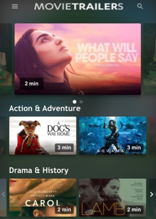
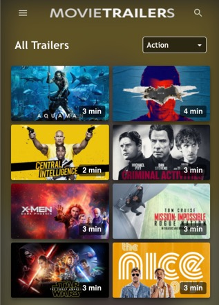
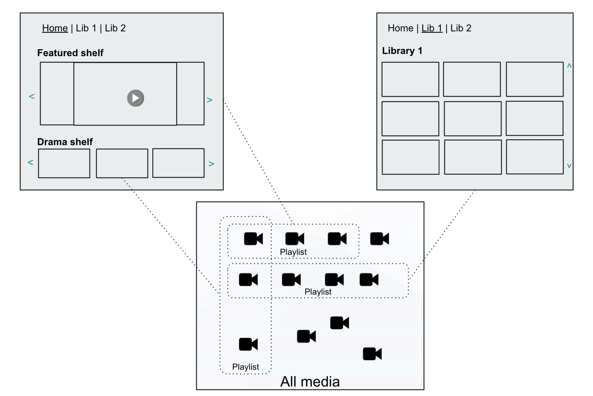

# Video Shelves and Libraries

  

## Shelves

The homepage contains shelves. The standard usage is:

- shelves highlight the most relevant videos for a user

- shelves are visualized in rows of typically 20-40 items

- shelves have horizontal navigation

- shelves are sorted on popular or new content 'new action movies'

The are some special shelves

- featured shelf: highlight special videos, manually curated and visualized in top of the homepage

- favorite shelf: a list of video a user likes to watch in the future. See [Watchlist](user-watchlists.md)

- continue watching shelf:  a list of videos a user has not completed yet. See [Watchlist](user-watchlists.md)

## Libraries

A library allows viewers to browse all videos. The standard usage is: 

- Different libraries per format e.g  ‘movies’, ‘shorts’, ‘shows’
- About 50-500 items per library
- 5-20 genre filters e.g ‘action’, ‘drama’, ‘comedy’

## Video publishing using playlists

Videos are published to shelves and libraries using playlists:

- Playlist can be managed through JW Dashboard

- For manual paylist the items and their sorting are determined manually

- For dynamic plyalist items are added based on tags and sorted on most viewed, most recently published or alfabetically

- Playlists apply geoblocking: only the video available in the country of the viewer are returned. It used the IP address to determine the country

 

## Images
- The poster image is available in different resolutions
- Some platforms require alternate poster images. That needs to be handled with custom properties and a CMS that handles the images Future: alternate thumbnails from JW platform

## Retrieving shelves and libraries


## Retrieving shelf and library contents

Shelf an library contents are retrieved as a playlist. They can be retrieved with the Playlist API 

```
GET Playlist\<playlistid>
[{
 "title":"Video Title",
 "description":"Lorem ipsum dolor sit amet",  “ 
 "images":[
  {"src":"./media/dwEE1oBP/poster.jpg?width=640 " }, 
  {"src":"./media/dwEE1oBP/poster.jpg?width=1280" }
  {"src":"./media/dwEE1oBP/poster.mp4?width=1280" }]
},
{}
]
```

For large libraries, (>500) its possible to paginate. 
It’s possible to query based on tags and custom parameters
