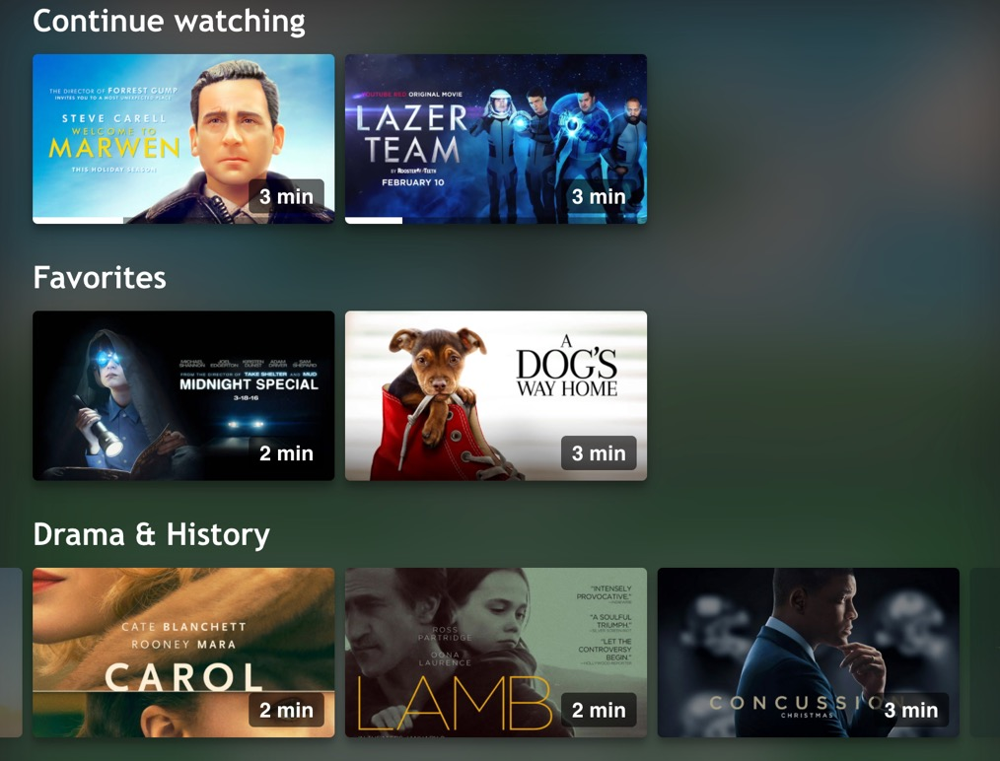

# User watchlists



######

## Favorites watchlist

This watchlist contains movies a user would like to watch in the future. It has the following behavior:

- In the video detail screen, the user can 'favorite' a movie or series.
  - In case new series flow is used the whole series item is marked as a favorite one.
  - In case old series flow us used only selected episode is marked as a favorite one
- On the homepage, a 'favorite' shelf appears, allowing the user to watch a media item
- The user menu shows a link to the list of favorites, including a 'clear' button

## Continue watchlist

This watchlist contains movies a user has not entirely watched. It has the following behavior:

**Across the app**

- A progress bar shows how much of the content a viewer has watched
- When a partially watched video is completed, it is removed from the shelf and the progress bar disappears
- Just started (<5%) and almost completed (>95%) plays are ignored for the best experience.
- For series
  - A selected episode being watched is used.
  - In case new series functionality is used only the last watched is stored
  - In case old series functionality multiple episodes of the same series can be shown in Continue Watching section

**On the homepage**

- A “Continue Watching" shelf is added to the home page when there are incomplete items
- The most recent views appear first
- When empty, the shelf is hidden from the home page.
- For series
  - In case old series functionality is used separate episodes are shown in Continue Watching section
  - In case new series functionality is used the whole series object is shown. When clicking on it a customer get redirected to the episodes which has been watched recently.

**The player**

- The player automatically resumes from the previous drop off point

## Storage

For non-logged in users, the watch history is stored clientside in local storage.

For logged in users, the favorites and watch history are stored server side at the subscription or authentication provider to enable **cross-device watch history**.

To ensure a **cross-device experience**, we standardize on the following dataformat:

### Watch history format

```
"history":[
         {
            "mediaid":"JfDmsRlE",
            "seriesId":"kDsDas31", // optional param for the new series functionality
            "progress":0.1168952164107527
         }
      ]
```

### Favorites format

```
"favorites":[
         {
            "mediaid":"JfDmsRlE",
         }
     ]
```

## Watchlist playlist

The media metadata for the stored media ids can be retrieved through a [watchlist playlist](https://developer.jwplayer.com/jwplayer/docs/creating-and-using-a-watchlist-playlist):

```
curl 'https://cdn.jwplayer.com/apps/watchlists/<watchlist-id>?media_ids=<media-ids-comma-seperated>'
```

Note that a watchlist need to be created first:

```
curl 'https://api.jwplayer.com/v2/sites/<property-id>/playlists/watchlist_playlist' \
 -H 'authorization: <property-api-key>' \
 -H 'content-type: application/json' \
 --data-raw '{"metadata": {}}'
```

## Configuration

The continue watching and favorites features can be enabled and disabled in the [app config](/docs/configuration.md).

## Cleeng

https://cleeng.com is a subscription management system, which pre-integrated in the web-app.

For Cleeng we store the watch history in the `customer externalData` attribute. See [here](https://developers.cleeng.com/reference/fetch-customers-data).

### Example Request

```
curl 'https://mediastore-sandbox.cleeng.com/customers/123456789' \
  -X 'PATCH' \
  -H 'authorization: Bearer <token>' \
  --data-raw '{"id":"123456789","externalData":{"history":[{"mediaid":"JfDmsRlE","progress":0.1168952164107527},{"mediaid":"3qMpbJM6","progress":null}],"favorites":[{"mediaid":"JfDmsRlE"}]}}'
```

Example data format

```
 {
   "id":"123456789",
   "externalData":{
      "history":[
         {
            "mediaid":"JfDmsRlE",
            "progress":0.1168952164107527
         }
       ],
      "favorites":[
         {
            "mediaid":"JfDmsRlE",
         }
      ]
}
```

### Max 48 items

Cleeng customer `externalData` attribute has maxsize of 5000 symbols.

The length of one stringified object of History equals to 52 symbols, one Favorites object equals to 22 symbols. Taking into account only History objects, we get 5000 / 52 = ~96, so 48 for Favorites and 48 for History. We also leave some extra space for possible further updates.

We rotate the oldest continue watching object to the first item position after its progress property gets a new value.
