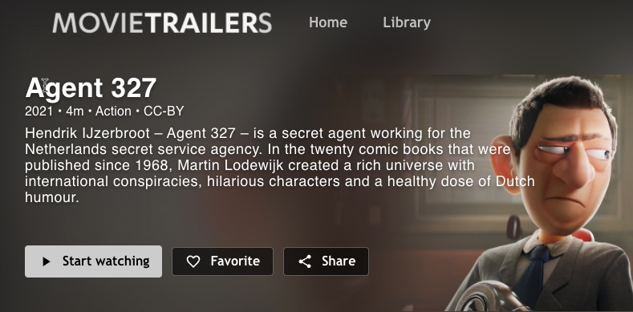

# Share URLs

Viewers can share a video: 
- On the desktop this will copy the URL to the clipboard  
- On mobile devices, this will share the URL through the device sharing window  

## Configuration

Sharing can be enabled/disabled in the [app config](/docs/configuration.md)

## Player configuration

The player also has a share button. It is advised that customers disable this in the  [the JW Player Config](https://support.jwplayer.com/articles/how-to-implement-social-sharing) that is linked to the web-app config.

## Deeplink to devices

In some cases opening a video URL on mobile device should open the native app rather than the web app. 

This is not supported at this moment in web app. This requires logic to detect the device and route the user to the local app or the app store in case the app is not install yet. 

Services such as [brach.io](branch.io) and [Google Firebase Dynamic Links]([Firebase Dynamic Links | Deep link potential users to the right place inside your app](https://firebase.google.com/products/dynamic-links)) solve this problem.
